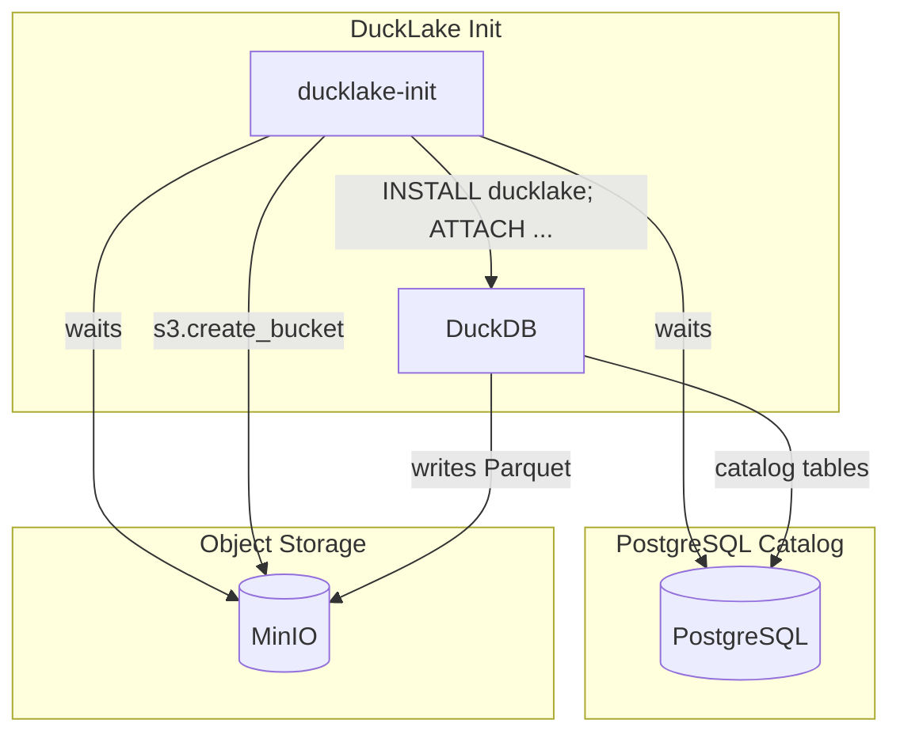

# Quack: DuckLake Local Deployment

This repository provides a Docker Compose setup to run a local DuckLake lakehouse stack using PostgreSQL as the catalog database and MinIO as S3-compatible object storage. It leverages the DuckLake extensions for DuckDB to bootstrap or attach to an existing lakehouse automatically.

## Table of Contents

- [Overview](#overview)
- [Architecture](#architecture)
- [Prerequisites](#prerequisites)
- [Getting Started](#getting-started)
- [Configuration](#configuration)
- [Usage](#usage)
- [References](#references)

## Overview

DuckLake is an open‑source lakehouse solution built on top of DuckDB, providing ACID transactions, versioning, and metadata management via pluggable catalogs (e.g., PostgreSQL).

Our setup:

- **PostgreSQL**: Stores the DuckLake catalog (metadata, transaction logs).
- **MinIO**: Provides an S3‑compatible endpoint for Parquet data files.
- **ducklake-init**: A Python `uv` script that:
  1. Waits for PostgreSQL & MinIO to be healthy
  2. Creates the S3 bucket if missing
  3. Runs DuckDB to `ATTACH` or initialize the lakehouse

On first run, DuckLake initializes the catalog tables in PostgreSQL and creates your data folder in MinIO. On subsequent runs, it detects existing metadata and simply re‑attaches to the lakehouse.

## Architecture



## Prerequisites

- Docker & Docker Compose v1.29+
- Linux, macOS, or Windows with WSL2

## Getting Started

1. **Clone the repo**

   ```bash
   git clone https://github.com/your-org/ducklake-local.git
   cd ducklake-local
   ```

2. **Launch the stack**

   ```bash
   docker-compose up -d
   ```

3. **Connect to DuckDB**

   ```bash
   docker-compose exec ducklake-init duckdb
   ```

4. **Verify the lakehouse**

   ```sql
   INSTALL ducklake;
   INSTALL postgres;
   ATTACH 'ducklake:postgres:dbname=ducklake_catalog host=postgres user=ducklake password=ducklake' AS the_ducklake (DATA_PATH 's3://ducklake/lake/');
   USE the_ducklake;
   SELECT * FROM ducklake.schema;
   ```

## Configuration

All credentials and endpoints are controlled via environment variables in `docker-compose.yml`:

| Variable                 | Default                                | Purpose                     |
| ------------------------ | -------------------------------------- | --------------------------- |
| POSTGRES\_USER           | ducklake                               | PostgreSQL catalog user     |
| POSTGRES\_PASSWORD       | ducklake                               | PostgreSQL catalog password |
| POSTGRES\_DB             | ducklake\_catalog                      | PostgreSQL database name    |
| AWS\_ACCESS\_KEY\_ID     | minioadmin                             | MinIO access key            |
| AWS\_SECRET\_ACCESS\_KEY | minioadmin                             | MinIO secret key            |
| AWS\_ENDPOINT\_URL       | [http://minio:9000](http://minio:9000) | S3 endpoint                 |
| BUCKET                   | ducklake                               | S3 bucket for Parquet files |

## Usage

- **Fresh Lake Initialization**: The `ATTACH` command will auto‑bootstrap if no catalog tables are found.
- **Re‑attach to Existing Lake**: Restarting `ducklake-init` will reconnect to your existing metadata and data without data loss.

For advanced options, see the [DuckLake documentation](https://ducklake.select/docs/stable/) for details on DataFrame APIs, versioning, and catalog backends.

## References

- DuckLake Stable Docs: [https://ducklake.select/docs/stable/](https://ducklake.select/docs/stable/)
- DuckDB Extensions Guide: [https://duckdb.org/docs/extensions/ducklake](https://duckdb.org/docs/extensions/ducklake)

