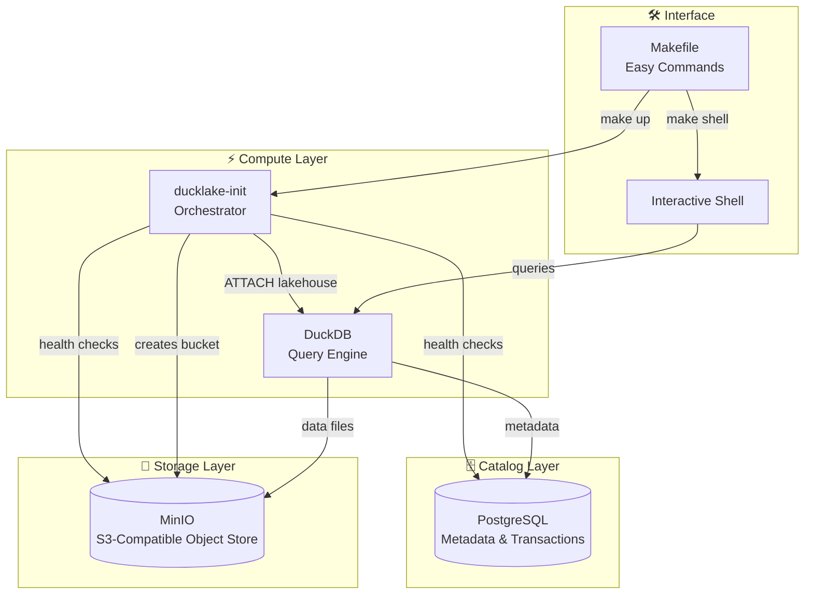

# 🦆 Quack: DuckLake Local Deployment

[](https://github.com/MattOates/quack/actions/workflows/ci.yml)
[](https://opensource.org/licenses/MIT)
[](https://www.docker.com/)
[](https://duckdb.org/)

> **🚀 One command to rule them all: `make dev-setup`**

A batteries-included Docker Compose setup for running a complete **DuckLake lakehouse** locally. Get PostgreSQL catalog + MinIO object storage + DuckDB with zero configuration fuss.

## ✨ Features

- 🏠 **Complete Lakehouse Stack** - PostgreSQL catalog + MinIO S3 storage + DuckDB compute
- ⚡ **Zero Configuration** - Everything works out of the box with sensible defaults  
- 🛠️ **Easy Makefile Interface** - Simple commands for all operations
- 🔄 **ACID Transactions** - Full lakehouse capabilities with versioning
- 📊 **Demo Data Included** - Pre-loaded with 44k+ gene records for testing
- 🐳 **Docker Everything** - No local dependencies except Docker
- 💾 **Data Persistence** - Your data survives container restarts

## 🚀 Quick Start

```bash
# Clone and start everything
git clone https://github.com/MattOates/quack.git
cd quack
make demo

# Or for development setup
make dev-setup

# Connect and start querying
make shell
```

That's it! You now have a fully functional lakehouse running locally.

## 📋 Table of Contents

- [Architecture](#-architecture)
- [Prerequisites](#-prerequisites)  
- [Installation](#-installation)
- [Usage](#-usage)
- [Makefile Commands](#-makefile-commands)
- [Configuration](#-configuration)
- [Examples](#-examples)
- [Troubleshooting](#-troubleshooting)
- [References](#-references)

## 🏗️ Architecture

**DuckLake** is an open-source lakehouse solution built on DuckDB, providing ACID transactions, versioning, and metadata management via pluggable catalogs.



### Components

- **🗄️ PostgreSQL**: Stores lakehouse metadata, transaction logs, and schema information
- **💾 MinIO**: S3-compatible object storage for Parquet data files  
- **⚡ DuckDB**: High-performance analytical query engine with lakehouse extensions
- **🛠️ ducklake-init**: Python orchestrator that configures and initializes everything

## 📦 Prerequisites

- **Docker Desktop** or **Docker + Docker Compose v2.0+**
- **4GB+ RAM** recommended  
- **macOS**, **Linux**, or **Windows with WSL2**

## 🔧 Installation

### Option 1: 🎯 Demo (Recommended for First Time)

```bash
git clone https://github.com/MattOates/quack.git
cd quack
make demo
```

This will:
- Build all Docker images
- Start PostgreSQL + MinIO + DuckDB  
- Load 44k+ gene records for testing
- Show you the results

### Option 2: 🏗️ Development Setup

```bash
git clone https://github.com/MattOates/quack.git
cd quack
make dev-setup
```

This will build and start everything without demo data.

### Option 3: 📖 Manual Steps

```bash
git clone https://github.com/MattOates/quack.git
cd quack
make build    # Build Docker images
make up       # Start services
make shell    # Connect to DuckDB
```

## 🎯 Usage

### Basic Operations

```bash
# Start everything
make up

# Connect to DuckDB shell (with DuckLake pre-attached)
make shell

# Check service health
make health

# View logs
make logs

# Stop everything
make down
```

### Working with Data

Once connected via `make shell`, DuckLake is automatically attached as `the_ducklake`:

```sql
-- Your lakehouse is ready to use!
USE the_ducklake;

-- Create a table from remote data
CREATE TABLE my_data AS 
SELECT * FROM read_csv_auto('https://example.com/data.csv');

-- Query with full SQL support
SELECT COUNT(*) FROM my_data;

-- DuckLake handles ACID transactions automatically
INSERT INTO my_data VALUES ('new', 'row');
```

## 🛠️ Makefile Commands

### 🚀 **Quick Start**
| Command | Description |
|---------|-------------|
| `make help` | Show all available commands |
| `make dev-setup` | Complete development setup (build + start) |
| `make demo` | Run demo with sample gene data |
| `make shell` | Connect to DuckDB with DuckLake attached |

### 🔧 **Build & Runtime**
| Command | Description |
|---------|-------------|
| `make build` | Build all Docker images (clean) |
| `make build-quick` | Build using cache |
| `make up` | Start all services |
| `make down` | Stop all services |
| `make restart` | Restart everything |

### 📊 **Monitoring & Debug**
| Command | Description |
|---------|-------------|
| `make health` | Check service health |
| `make status` | Show service status |
| `make logs` | View all logs |
| `make logs-init` | View DuckLake init logs |
| `make test-connection` | Test DuckLake connection |

### 🔗 **Connections**  
| Command | Description |
|---------|-------------|
| `make shell` | DuckDB shell |
| `make psql` | PostgreSQL shell |
| `make minio-console` | Open MinIO web console |
| `make info` | Show connection details |

### 💾 **Data Management**
| Command | Description |
|---------|-------------|
| `make backup-data` | Create timestamped backup |
| `make restore-data BACKUP_FILE=backup.tar.gz` | Restore from backup |
| `make clean-data` | Remove all data (with confirmation) |
| `make reset` | Complete reset (stop, clean, rebuild, start) |

### 🧹 **Maintenance**
| Command | Description |
|---------|-------------|
| `make pull` | Pull latest Docker images |
| `make prune` | Clean up Docker resources |

## ⚙️ Configuration

All service configuration is controlled via environment variables in `docker-compose.yml`. The defaults work out of the box, but you can customize as needed:

| Variable | Default | Purpose |
|----------|---------|---------|
| `POSTGRES_USER` | `ducklake` | PostgreSQL catalog username |
| `POSTGRES_PASSWORD` | `ducklake` | PostgreSQL catalog password |  
| `POSTGRES_DB` | `ducklake_catalog` | PostgreSQL database name |
| `AWS_ACCESS_KEY_ID` | `minioadmin` | MinIO access key |
| `AWS_SECRET_ACCESS_KEY` | `minioadmin` | MinIO secret key |
| `AWS_ENDPOINT_URL` | `http://minio:9000` | S3 endpoint URL |
| `BUCKET` | `ducklake` | S3 bucket for data files |

### 🔗 Service Endpoints

| Service | URL | Credentials |
|---------|-----|-------------|
| **MinIO Console** | http://localhost:9000 | admin/minioadmin |
| **PostgreSQL** | localhost:5432 | ducklake/ducklake |
| **DuckDB Shell** | `make shell` | Pre-configured |

## 📝 Examples

### Example 1: Loading CSV Data

```sql
-- Connect via: make shell

-- Load remote CSV data into your lakehouse
CREATE TABLE companies AS
SELECT * FROM read_csv_auto(
    'https://example.com/companies.csv',
    HEADER => TRUE
);

-- Query with full analytical SQL
SELECT 
    industry, 
    COUNT(*) as company_count,
    AVG(revenue) as avg_revenue
FROM companies 
GROUP BY industry 
ORDER BY avg_revenue DESC;
```

### Example 2: Working with Parquet

```sql
-- Load Parquet files from S3/MinIO
CREATE TABLE events AS
SELECT * FROM read_parquet('s3://ducklake/raw/events/*.parquet');

-- Transform and store back to lakehouse
CREATE TABLE daily_summary AS
SELECT 
    DATE(timestamp) as date,
    event_type,
    COUNT(*) as event_count
FROM events
GROUP BY DATE(timestamp), event_type;
```

### Example 3: Time Travel Queries

```sql
-- DuckLake supports versioning and time travel
SELECT * FROM my_table VERSION AS OF '2024-01-01 10:00:00';

-- View table history
SELECT * FROM table_history('my_table');
```

## 🔧 External DuckDB Connection

If you want to connect to the lakehouse from an external DuckDB client (outside the container), use this configuration:

```sql
-- Install required extensions
INSTALL ducklake;
INSTALL postgres;
INSTALL httpfs;

-- Configure S3 settings for MinIO
SET s3_url_style = 'path';
SET s3_endpoint = 'localhost:9000';  -- Note: localhost, not minio
SET s3_access_key_id = 'minioadmin';
SET s3_secret_access_key = 'minioadmin';
SET s3_region = 'us-east-1';
SET s3_use_ssl = false;

-- Attach to your lakehouse
ATTACH 'ducklake:postgres:dbname=ducklake_catalog host=localhost user=ducklake password=ducklake'
AS my_lakehouse (DATA_PATH 's3://ducklake/lake/');

-- Now you can use it
USE my_lakehouse;
SHOW TABLES;
```

## 🐍 Python Connection Example

You can also connect to `the_ducklake` from your own Python applications. Here's a complete example:

### Installation

```bash
uv add --prerelease=allow duckdb boto3 psycopg2-binary
```

or

```bash
pip install --pre duckdb boto3 psycopg2-binary
```

### Python Code

```python
#!/usr/bin/env -S uv run --script --prerelease=allow
#
# /// script
# requires-python = ">=3.13.5"
# dependencies = [
#   "boto3",
#   "psycopg",
#   "duckdb",
# ]
# ///
import duckdb
import os

def connect_to_ducklake():
    """Connect to the DuckLake lakehouse from Python."""
    
    # Create DuckDB connection
    con = duckdb.connect()
    
    # Install required extensions
    con.install_extension("ducklake")
    con.install_extension("postgres")   
    con.install_extension("httpfs")
    
    # Configure S3/MinIO settings
    s3_config = {
        "s3_url_style": "path",
        "s3_endpoint": "localhost:9000",  # External connection
        "s3_access_key_id": "minioadmin",
        "s3_secret_access_key": "minioadmin", 
        "s3_region": "us-east-1",
        "s3_use_ssl": "false"
    }
    
    for key, value in s3_config.items():
        con.execute(f"SET {key}='{value}';")
    
    # Attach to DuckLake
    attach_sql = """
    ATTACH 'ducklake:postgres:dbname=ducklake_catalog host=localhost user=ducklake password=ducklake'
    AS the_ducklake (DATA_PATH 's3://ducklake/lake/');
    """
    con.execute(attach_sql)
    con.execute("USE the_ducklake;")
    
    return con

def main():
    """Example usage of DuckLake connection."""
    
    # Make sure your quack stack is running first!
    # cd /path/to/quack && make up
    
    con = connect_to_ducklake()
    
    # Example 1: List available tables
    tables = con.execute("SHOW TABLES;").fetchall()
    print("Available tables:", tables)
    
    # Example 2: Create a sample table
    con.execute("""
        CREATE OR REPLACE TABLE python_example AS
        SELECT 
            'hello' as greeting,
            'world' as target,
            42 as meaning_of_life,
            current_timestamp as created_at
    """)
    
    # Example 3: Query the data
    result = con.execute("SELECT * FROM python_example;").fetchall()
    print("Sample data:", result)
    
    # Example 4: Load data from a CSV
    con.execute("""
        CREATE OR REPLACE TABLE sample_data AS
        SELECT 
            row_number() OVER () as id,
            'user_' || row_number() OVER () as username,
            random() * 100 as score
        FROM generate_series(1, 1000)
    """)
    
    # Example 5: Analytical query
    stats = con.execute("""
        SELECT 
            COUNT(*) as total_records,
            AVG(score) as avg_score,
            MIN(score) as min_score,
            MAX(score) as max_score
        FROM sample_data
    """).fetchone()
    
    print(f"Dataset stats: {stats}")
    
    # Example 6: Work with time series data
    con.execute("""
        CREATE OR REPLACE TABLE time_series AS
        SELECT 
            (current_date - INTERVAL (row_number() OVER ()) DAY) as date,
            random() * 1000 as value
        FROM generate_series(1, 365)
    """)
    
    monthly_summary = con.execute("""
        SELECT 
            date_trunc('month', date) as month,
            COUNT(*) as records,
            AVG(value) as avg_value,
            SUM(value) as total_value
        FROM time_series
        GROUP BY date_trunc('month', date)
        ORDER BY month
    """).fetchall()
    
    print("Monthly summary:", monthly_summary[:3])  # Show first 3 months
    
    # Don't forget to close the connection
    con.close()
    print("✅ DuckLake connection example completed!")

if __name__ == "__main__":
    main()
```

### Advanced Usage

For production applications, consider using connection pooling and environment variables:

```python
import os
from contextlib import contextmanager

@contextmanager
def ducklake_connection():
    """Context manager for DuckLake connections."""
    con = None
    try:
        con = duckdb.connect()
        
        # Install extensions
        for ext in ["ducklake", "postgres", "httpfs"]:
            con.execute(f"INSTALL {ext};")
        
        # Configure from environment
        s3_config = {
            "s3_url_style": "path",
            "s3_endpoint": os.getenv("DUCKLAKE_S3_ENDPOINT", "localhost:9000"),
            "s3_access_key_id": os.getenv("DUCKLAKE_S3_ACCESS_KEY", "minioadmin"),
            "s3_secret_access_key": os.getenv("DUCKLAKE_S3_SECRET_KEY", "minioadmin"),
            "s3_region": os.getenv("DUCKLAKE_S3_REGION", "us-east-1"),
            "s3_use_ssl": "false"
        }
        
        for key, value in s3_config.items():
            con.execute(f"SET {key}='{value}';")
        
        # Connection details from environment
        pg_host = os.getenv("DUCKLAKE_PG_HOST", "localhost")
        pg_user = os.getenv("DUCKLAKE_PG_USER", "ducklake")
        pg_pass = os.getenv("DUCKLAKE_PG_PASSWORD", "ducklake") 
        pg_db = os.getenv("DUCKLAKE_PG_DB", "ducklake_catalog")
        bucket = os.getenv("DUCKLAKE_BUCKET", "ducklake")
        
        attach_sql = f"""
        ATTACH 'ducklake:postgres:dbname={pg_db} host={pg_host} user={pg_user} password={pg_pass}'
        AS the_ducklake (DATA_PATH 's3://{bucket}/lake/');
        """
        con.execute(attach_sql)
        con.execute("USE the_ducklake;")
        
        yield con
        
    finally:
        if con:
            con.close()

# Usage with context manager
def analyze_data():
    with ducklake_connection() as con:
        # Your analysis code here
        result = con.execute("SELECT COUNT(*) FROM your_table;").fetchone()
        return result
```

### Environment Variables

For the advanced example, you can set these environment variables:

```bash
export DUCKLAKE_S3_ENDPOINT="localhost:9000"
export DUCKLAKE_S3_ACCESS_KEY="minioadmin"  
export DUCKLAKE_S3_SECRET_KEY="minioadmin"
export DUCKLAKE_PG_HOST="localhost"
export DUCKLAKE_PG_USER="ducklake"
export DUCKLAKE_PG_PASSWORD="ducklake"
export DUCKLAKE_PG_DB="ducklake_catalog"
export DUCKLAKE_BUCKET="ducklake"
```

## 🐛 Troubleshooting

### Services Won't Start

```bash
# Check service status
make status

# Check health
make health

# View logs for issues
make logs

# Nuclear option - complete reset
make reset
```

### Connection Issues

```bash
# Test the connection
make test-connection

# Check if services are healthy
make health

# View specific service logs
make logs-postgres  # or logs-minio, logs-init
```

### Performance Issues

- **Increase Docker memory**: Ensure Docker has at least 4GB RAM allocated
- **Check disk space**: Ensure sufficient space in `./data/` directory
- **Monitor logs**: Use `make logs` to check for errors

### Data Issues

```bash
# Create backup before troubleshooting
make backup-data

# Clean slate restart
make clean-data  # ⚠️ This deletes all data!
make dev-setup

# Restore from backup if needed
make restore-data BACKUP_FILE=backup_20241201_120000.tar.gz
```

## 🤝 Contributing

1. Fork the repository
2. Create a feature branch: `git checkout -b my-feature`
3. Make changes and test with `make dev-setup`
4. Commit changes: `git commit -am 'Add feature'`
5. Push to branch: `git push origin my-feature`
6. Open a Pull Request

## 📚 References

### Documentation
- 📖 [DuckLake Documentation](https://ducklake.select/docs/stable/) - Official DuckLake docs
- 🦆 [DuckDB Extensions Guide](https://duckdb.org/docs/extensions/ducklake) - DuckDB lakehouse extensions
- 🐳 [Docker Compose Reference](https://docs.docker.com/compose/) - Container orchestration

### Related Projects  
- 🏠 [Apache Iceberg](https://iceberg.apache.org/) - Alternative lakehouse format
- ⚡ [DuckDB](https://duckdb.org/) - Analytical database engine
- 📊 [Apache Arrow](https://arrow.apache.org/) - Columnar data format

---

<div align="center">

**🦆 Happy Quacking! 🦆**

Made with ❤️ for the data community

[⭐ Star this repo](https://github.com/MattOates/quack) • [🐛 Report Issues](https://github.com/MattOates/quack/issues) • [📖 Documentation](https://ducklake.select/docs/stable/)

</div>

